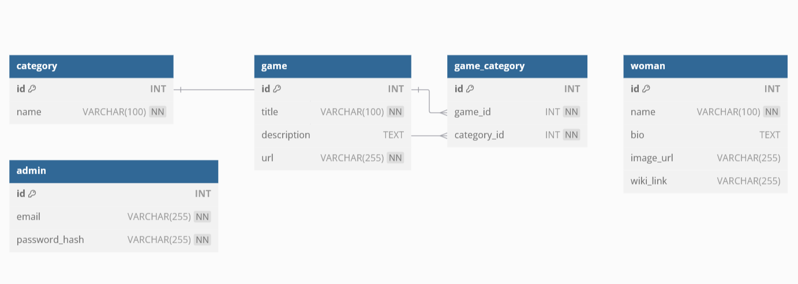

# 🎯 Girl Power Code - Préparation du Projet

## 📌 Introduction
**Girl Power Code** est un site éducatif destiné aux jeunes filles de **7 à 13 ans** pour les initier à la programmation et leur faire découvrir les **femmes qui ont marqué l'histoire de la tech**.

---

## 📋 User Stories

### 🎮 **Gestion des jeux**
- 🧑‍🎓 *En tant qu’utilisatrice, je veux accéder à une liste de jeux pour apprendre à coder.*  
- 📚 *En tant qu’utilisatrice, je veux voir une courte description de chaque jeu avant d’y accéder.*  
- 🛠️ *En tant qu’administrateurice, je veux pouvoir ajouter et supprimer des jeux dans la base de données.*  

### 👩‍💻 **Découverte des héroïnes de la tech**
- 🌟 *En tant qu'utilisatrice, je veux voir des fiches de femmes célèbres dans l’informatique pour m’inspirer.*  
- 🔍 *En tant qu’utilisatrice, je veux pouvoir lire une biographie courte sur chaque femme inspirante.*  

### 🔐 **Administration**
- ⚙️ *En tant qu’administrateurice, je veux pouvoir me connecter pour gérer les données du site (ajouter, modifier, supprimer des jeux et fiches de femmes inspirantes).*  
- 🔒 *En tant qu’administrateurice, je veux que l’accès à l’administration soit sécurisé avec un mot de passe.*  

---

## 🖼 Wireframe

## 🗃️ Modélisation de la Base de Données

### **📌 Structure des Tables**
#### `category`
| id | name |
|----|------|
| `INT PRIMARY KEY AUTO_INCREMENT` | `VARCHAR(100) NOT NULL` |

#### `game`
| id | title | description | url |
|----|-------|------------|-----|
| `INT PRIMARY KEY AUTO_INCREMENT` | `VARCHAR(100) NOT NULL` | `TEXT` | `VARCHAR(255) NOT NULL` |

#### `game_category`
| id | game_id | category_id |
|----|---------|------------|
| `INT PRIMARY KEY AUTO_INCREMENT` | `INT NOT NULL` (FK → game.id) | `INT NOT NULL` (FK → category.id) |

#### `woman`
| id | woman_name | bio | image_url | wiki_link |
|----|------|-----|-----------|-----------|
| `INT PRIMARY KEY AUTO_INCREMENT` | `VARCHAR(100) NOT NULL` | `TEXT` | `VARCHAR(255)` | `VARCHAR(255)` |

#### `admin`
| id | email | password_hash |
|----|-------|--------------|
| `INT PRIMARY KEY AUTO_INCREMENT` | `VARCHAR(255) UNIQUE NOT NULL` | `VARCHAR(255) NOT NULL` |

